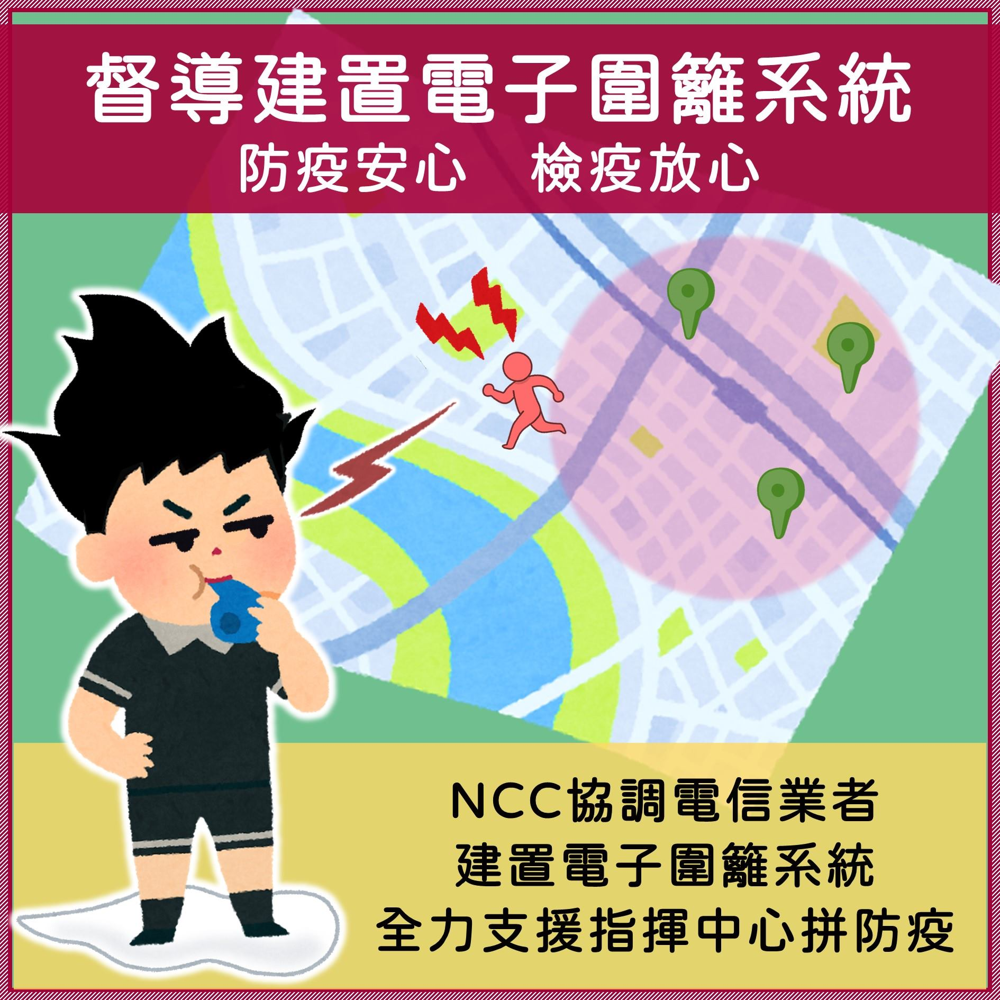
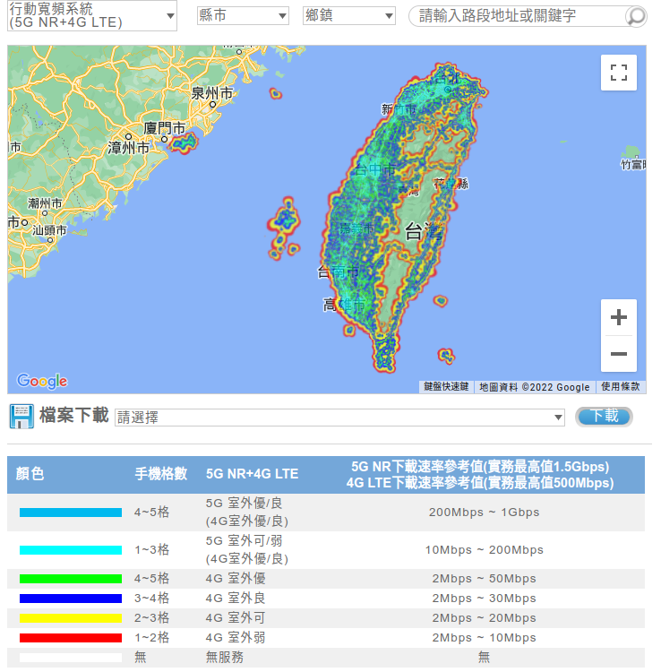

# Background

## Development of Electronic Fence in Taiwain

At beginning of 2021,COVID-19 ravaged the world.Inthe face of this highly contagious disease,the Tainwain government stipulated that people infected with the epicdemic or those who were framed need to be quarantined,and jiontly developed an electronic epidemic prevention platform wuth the Health Bureau,the five major telecommunications companies and NCC().Whether the SIM Card is in the fixed range of the base station to detected whether the quarantined person has left the quarantine range.

When the mobile phone is connected to a nearby base station, in addition to the door number information, there is also the mobile phone IMEI information, which can be used to bind the door number, mobile phone, and personal data. As long as you have a mobile phone or SIM card, it can be detected. your approximate location. Therefore, the command center can track the door number, IMEI code and other information to confirm which base station the home quarantine person is near, and then find the location of the home quarantine person and the autonomous health manager.

We can see in this phenomenon that it used in this situation and playing an important role in the epidemic.***But you may asked:***

***"But it only works in this case."***

We can imagine more applications of it, such as boarding schools, or workplaces. If it is more open to imagination, it can be "avoid entering certain areas" rather than "prohibit leaving certain areas", which can mark hazardous substances or Dangerous places, so that we can immediately go over and take action when others enter the area, we think this is a feasible idea, after all, who said fences are for keeping others in?

---
## The relationship between electronic fence and 5G
Why is 5G-based electronic fence suitable for development? We explain why 5G is suitable for the development of electronic fences based on several characteristics

1. **Deployment of small base stations to increase handover frequency** 1
   The density of base stations increases, which means that in a limited area (here, it can be regarded as a base station that can receive signals within the  fence range), the frequency of handover becomes higher. Positioning accuracy.
    See the picture below, the following is the signal distribution of Chunghwa Telecom 5G base station.
    See: Mobile broadband system 5G NR+4G LTE covered Website <https://coverage.cht.com.tw/coverage/tw.html>

    
2. **Beam pointing problem caused by mmWave (26 GHz) communication, which requires user's location information** 2
   Positioning and 5G are mutually complementary links. Signal positioning technology will be valued in the future, and the classic "electronic fence" used in its application will also be technically improved.
3. **The low-latency requirement of IoV communication also introduces the requirement of mutual positioning between workshops** 3
   If a larger area is selected, such as a city, then people may move with vehicles, and the signal positioning will become very complicated. In terms of the Doppler effect alone, the uncertainty of the calculation will become higher, and the calculation The vehicle may be moved to another location within the required time.
    For this we need the low latency of 5G, and edge computing technology to avoid this.
4. **The rise of MEC technology**
    MEC technology is a technology to improve the speed of 5G. Edge computing allows different blocks to do different tasks so that the access network does not need to calculate other things to slow down performance.

---
