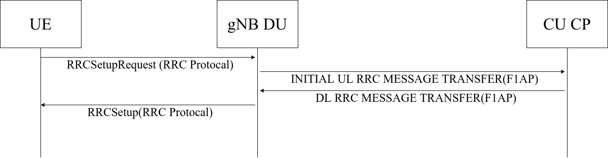
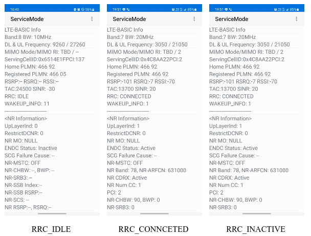
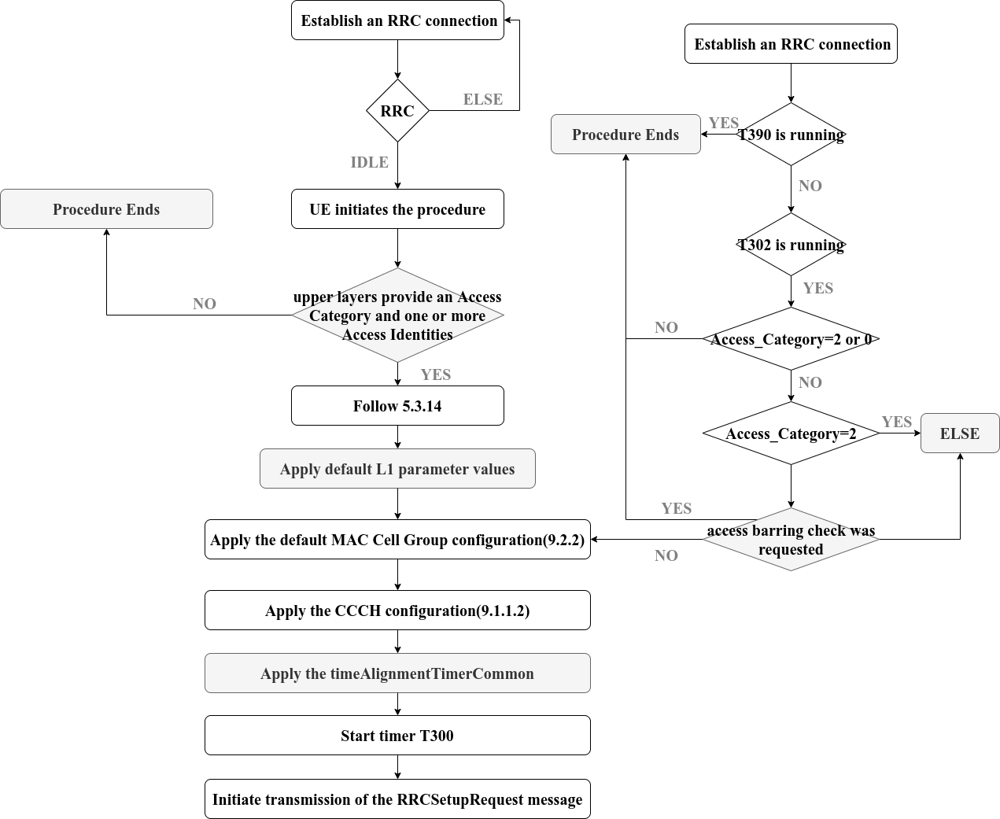
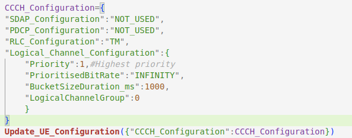

# RRCSetUp for MUltiple gNBs System

>[See ETSI TS 138 331 V16.3.1 (2021-01) 5G NR Radio Resource Control (RRC) Protocol specification (3GPP TS 38.331 version 16.3.1 Release 16)](https://www.etsi.org/deliver/etsi_ts/138300_138399/138331/16.03.01_60/ts_138331v160301p.pdf)

Generally speaking, there will be two results in this stage: RRCSetUp and RRCReject, but it is certain that RRCReject will be returned in the DU, and the exceptions to the subsequent F1AP agreement will be written Not applicable. (Not applicable). According to this theorem, We simulate this process and try to comply with the 3GPP TS, because this is the first step to access the core network, and the signaling is SRB0 at this time.

## Iinitalization

When the UE is in RRC_IDLE and has acquired the necessary system information, the UE initiates this process when the upper layer requests to establish an RRC connection.

In the system, we set a parameter called "RRC". It indicates the RRC status of the UE, like it is real in our life. For some Samsung mobile phones, you can enter `*#0011#`  in the mobile phone to get some signal information. We use *Samsung Glaxy A53* mobile phone with 5G solution to check the RRC status as follows

It should be noted that LTE did not originally have the RRC_INACTIVE state. It was introduced after the R13 specification of 5G in order to reduce signaling and power consumption, because 5G technology will generate a lot of power consumption, and RRC is hobby in the case of high speed. The key to electricity, a large number of devices transmitting a small amount of data will generate excessive signaling consumption.

In a word, in the RRC_IDLE state (idle state), initialization will be performed, and then the UE will send the RRCSetupRequest through the Common Control Channel (hereinafter referred to as CCCH) channel.

The following is the flow chart of the Initiation, the gray indicates that the system has not implemented it or will keep it.

In the Single gNB System, we will simulate the high physical layer of the main control UE, but based on NFV technology, we will focus on the content of the protocol, the focus here is to configure the part of CCCH and protocol 5.3. 14 content, strictly enforce the simulation. In the Multiple gNBs System, we will focus on CellGroupConfiguration, because here we need to configure the UE's MCG and SCG, here we do not consider SPCell.
Pay attention to the number at the back, you can use it to compare the content of the agreement, and our attachment here also mentions the part.

### Apply the CCCH configuration

#### **Parameters**

| Name | Value | Semantics description |
| :--: | :--:  | :--: |
| SDAP configuration | NOTUSED | - |
| PDCP configuration | NOTUSED | - |
| RLC configuration | TM | - |
| Logical channel configuration | - | - |
| >priority | 1 | Highest priority |
| >prioritisedBitRate | INFINITY | - |
| >bucketSizeDuration | ms1000  | - |
| >logicalChannelGroup | 0 | - |

Single LOS CCCH configuration part code

For configuration, refer to Chunghwa Telecom and general agreement content.

### Apply the default MAC Cell Group configuration

#### **Parameter**

| Name | Value | Semantics description |
| :--: | :--:  | :--: |
| MAC Cell Group configuration | - | - |
| bsr-Config  | - | - |
| >periodicBSR-Timer  | sf10 | - |
| >retxBSR-Timer  | sf80 | - |
| phr-Config  | - | - |
| >phr-PeriodicTimer  | sf10 | - |
| >phr-ProhibitTimer  | sf10  | - |
| >phr-Tx-PowerFactorChange | dB1 | - |

In the Single gNB System, we do not pay attention to this part, because for a system simulated by a base station, there will not be more than one base station, and the CellGroup is ignored, but it is still symbolic in our setting The existence of multiple simulators may also be configured in a system. We try to retain these dynamic configurations without affecting performance. They are independent files in the system and are flexible in design.

However, in the Multiple gNBs System, its meaning is different. For cells that are divided into different groups (referred to as gNBs here), the gNBs to be accessed may be different, and the configurations of the MCG and SCG are different. Here we will first set a primary access PCell, and then let RRCSetUp return the new MCG configuration after access.

## ***RRCSetupRequest (RRC Protocal)***

>[See ETSI TS 138 331 V16.3.1 (2021-01) 5G NR Radio Resource Control (RRC) Protocol specification (3GPP TS 38.331 version 16.3.1 Release 16)](https://www.etsi.org/deliver/etsi_ts/138300_138399/138331/16.03.01_60/ts_138331v160301p.pdf)
