# RRCSetUp for Multiple gNBs System

>[See ETSI TS 138 331 V16.3.1 (2021-01) 5G NR Radio Resource Control (RRC) Protocol specification (3GPP TS 38.331 version 16.3.1 Release 16)](https://www.etsi.org/deliver/etsi_ts/138300_138399/138331/16.03.01_60/ts_138331v160301p.pdf)

Generally speaking, there will be two results in this stage: RRCSetUp and RRCReject, but it is certain that RRCReject will be returned in the DU, and the exceptions to the subsequent F1AP agreement will be written Not applicable. (Not applicable). According to this theorem, We simulate this process and try to comply with the 3GPP TS, because this is the first step to access the core network, and the signaling is SRB0 at this time.

## Iinitalization

When the UE is in RRC_IDLE and has acquired the necessary system information, the UE initiates this process when the upper layer requests to establish an RRC connection.

In the system, we set a parameter called "RRC". It indicates the RRC status of the UE, like it is real in our life. For some Samsung mobile phones, you can enter `*#0011#`  in the mobile phone to get some signal information. We use *Samsung Glaxy A53* mobile phone with 5G solution to check the RRC status as follows

It should be noted that LTE did not originally have the RRC_INACTIVE state. It was introduced after the R13 specification of 5G in order to reduce signaling and power consumption, because 5G technology will generate a lot of power consumption, and RRC is hobby in the case of high speed. The key to electricity, a large number of devices transmitting a small amount of data will generate excessive signaling consumption.

In a word, in the RRC_IDLE state (idle state), initialization will be performed, and then the UE will send the RRCSetupRequest through the Common Control Channel (hereinafter referred to as CCCH) channel.

The following is the flow chart of the Initiation, the gray indicates that the system has not implemented it or will keep it.

In the Single gNB System, we will simulate the high physical layer of the main control UE, but based on NFV technology, we will focus on the content of the protocol, the focus here is to configure the part of CCCH and protocol 5.3. 14 content, strictly enforce the simulation. In the Multiple gNBs System, we will focus on CellGroupConfiguration, because here we need to configure the UE's MCG and SCG, here we do not consider SPCell.
Pay attention to the number at the back, you can use it to compare the content of the agreement, and our attachment here also mentions the part.

### Apply the CCCH configuration

#### **Parameters**

| Name | Value | Semantics description |
| :--: | :--:  | :--: |
| SDAP configuration | NOTUSED | - |
| PDCP configuration | NOTUSED | - |
| RLC configuration | TM | - |
| Logical channel configuration | - | - |
| >priority | 1 | Highest priority |
| >prioritisedBitRate | INFINITY | - |
| >bucketSizeDuration | ms1000  | - |
| >logicalChannelGroup | 0 | - |

Single LOS CCCH configuration part code

For configuration, refer to Chunghwa Telecom and general agreement content.

### Apply the default MAC Cell Group configuration

#### **Parameter**

| Name | Value | Semantics description |
| :--: | :--:  | :--: |
| MAC Cell Group configuration | - | - |
| bsr-Config  | - | - |
| >periodicBSR-Timer  | sf10 | - |
| >retxBSR-Timer  | sf80 | - |
| phr-Config  | - | - |
| >phr-PeriodicTimer  | sf10 | - |
| >phr-ProhibitTimer  | sf10  | - |
| >phr-Tx-PowerFactorChange | dB1 | - |

In the Single gNB System, we do not pay attention to this part, because for a system simulated by a base station, there will not be more than one base station, and the CellGroup is ignored, but it is still symbolic in our setting The existence of multiple simulators may also be configured in a system. We try to retain these dynamic configurations without affecting performance. They are independent files in the system and are flexible in design.

However, in the Multiple gNBs System, its meaning is different. For cells that are divided into different groups (referred to as gNBs here), the gNBs to be accessed may be different, and the configurations of the MCG and SCG are different. Here we will first set a primary access PCell, and then let RRCSetUp return the new MCG configuration after access.

## ***RRCSetupRequest (RRC Protocal)***

>[See ETSI TS 138 331 V16.3.1 (2021-01) 5G NR Radio Resource Control (RRC) Protocol specification (3GPP TS 38.331 version 16.3.1 Release 16)(5.3.3)](https://www.etsi.org/deliver/etsi_ts/138300_138399/138331/16.03.01_60/ts_138331v160301p.pdf)

Purpose: Request to establish an RRC connection. 
Carrying message: UE identity, RRC connection establishment reason
Here, if the upper layer carries 5G-S-TMSI, UE_Identity shall return ng-5G-S-TMSI-Part1, otherwise, a 32-bit identifier shall be randomly generated (unique in this Cell).

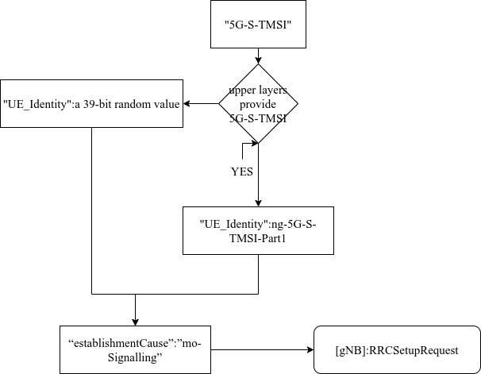

As shown in the table below, the parameter table will be represented by three values: Name is the IE name, Value is the default value (usually the main UE configured in the Single gNB LOS Uma), and Characteristic represents the generation method of the configuration in the system.
**Parameter**
| Name | Value | Characteristic |
| :--: | :--:  | :--: |
| UE_Identity | | Dynamic/Allocated |
| establishmentCause | mo-Signalling | Static  |
| UE_Name | UE_A | in UE Configuration |
| UE_IP | 10.0.2.100 | in UE Configuration |

bearer signaling:SRB0
logical channel:CCCH

See Actions related to transmission of RRCSetupRequest message [5.3.3.3] page 55

## ***INITIAL UL RRC MESSAGE TRANSFER(F1AP)***

>[See ETSI TS 138 331 V16.3.1 (2021-01) 5G NR Radio Resource Control (RRC) Protocol specification (3GPP TS 38.331 version 16.3.1 Release 16)(8.4.1)](https://www.etsi.org/deliver/etsi_ts/138300_138399/138331/16.03.01_60/ts_138331v160301p.pdf)

See Initial UL RRC Message Transfer  [8.4.1] page 58

### General

The purpose of the Initial UL RRC Message Transfer procedure is to transfer the initial RRC message to the gNB-CU.
The procedure uses non-UE-associated signaling.

### Successful operation 

The establishment of the UE-associated logical F1-connection shall be initiated as part of the procedure.

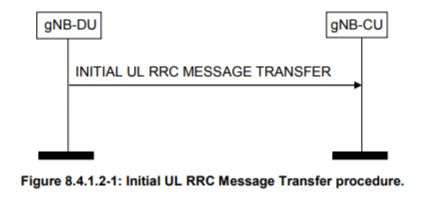

If the DU to CU RRC Container IE is not included in the INITIAL UL RRC MESSAGE TRANSFER, the gNB-CU should reject the UE under the assumption that the gNB-DU is not able to serve such UE.

 If the gNB-DU is able to serve the UE, the gNB-DU shall include the DU to CU RRC Container IE and the gNB-CU shall configure the UE as specified in TS 38.331 [8].

 The gNB-DU shall not include the ReconfigurationWithSync field in the CellGroupConfig IE as defined in TS 38.331 [8] of the DU to CU RRC Container IE.

If the SUL Access Indication IE is included in the INITIAL UL RRC MESSAGE TRANSFER, the gNB-CU shall consider that the UE has performed access on SUL carrier.
(Not implemented in the system)

If the RRC-Container-RRCSetupComplete IE is included in the INITIAL UL RRC MESSAGE TRANSFER, the gNBCU shall take it into account as specified in TS 38.401 [4].

Send the first RRC message to the gNB-CU
This process will establish a UE-level F1 connection

In the Multiple gNB System system, we will simulate the process of random access here. This part is not as rigorous as the access part. In fact, when the number of gNBs increases dramatically, it takes a very large amount to delineate within the range. In the follow-up, we also need to consider the situation of changing hands, in order to avoid dragging down the efficiency (note: the work we use to simulate the hardware will definitely be slower than the hardware, we will try our best to face this situation We will randomly access a Cell like random access, and then connect to a better signal through the algorithm. The following figure shows the calculation process in the Multiple gNB System system.

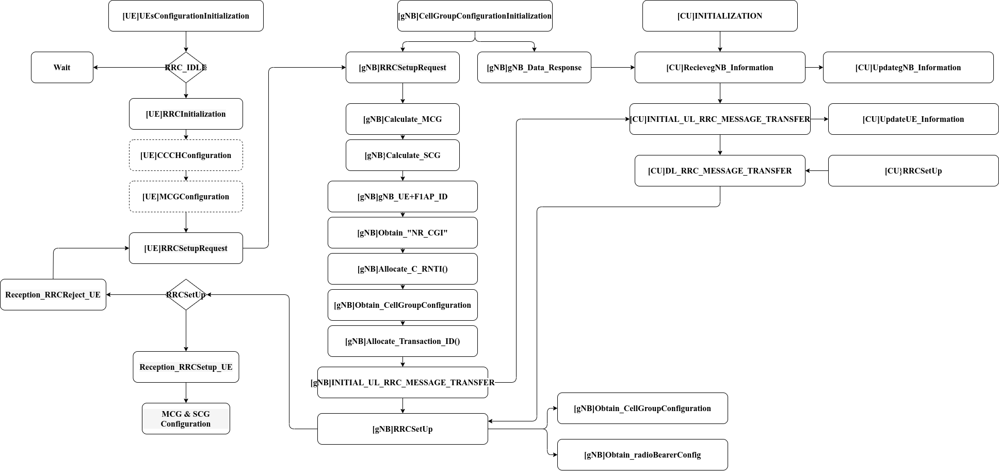

In this step, we will initially configure the MCG, Connected Primary Cell and SCG, Connected Secondary Cell according to the distance in this way. After passing it to the CU to update the configuration, we will send the updated UE_Information back to the gNB, and finally return to the UE to overwrite it. configuration.

**Parameter**

| Name | Value | Characteristic |
| :--: | :--:  | :--: |
| UE_Name | UE_Name | Dynamic form request |
| UE_IP | UE_IP | Dynamic form request |
| gNB_DU_UE_F1AP_ID | | Allocate/Request |
| NR CGI | | in Config |
| >PLMN | 46692 | in Config |
| >>MCC | 466 | in Config |
| >>MNC | 92 | in Config |
| >NR cell Identity | | in Config |
| >>gNB Identity | 1010010111000101010010 | in Config |
| >>Cell Identity | 1111001000000 | in Config |
| C-RNTI | | Allocate |
| RRC-Container| RRCSetupRequest | Static |
| DU to CU RRC Container | include CellGroupConfig | in Config |
| SUL Access Indication | True | Static |
| Transaction ID | | Allocate |

#### gNB-DU UE F1AP ID

The gNB-DU UE F1AP ID uniquely identifies the UE association over the F1 interface within the gNB-DU.
INTEGER(0,232-1)

#### C-RNTI 

Cell RNTI(Radio Network Temporary Identity)
INTEGER(0..65535, ...)

It is related to the cause and status of the UE access request. It is the most used RNTI. C-RNTI is not available at the beginning, but is allocated by the base station to the users who have successfully joined the network after the user accesses the network. If the UE is in the RRC_CONNECTED mode, it means that the C-RNTI has been allocated and needs to be reported when accessing; if the UE is in the IDLE mode, it means that there is no C-RNTI yet. Allocate a C-RNTI; when the user is handed over, the user can bring the C-RNTI allocated by this cell to the next cell, and there is no need to re-allocate the C-RNTI.

#### Transaction ID

The Transaction ID IE uniquely identifies a procedure among all ongoing parallel procedures of the same type initiated by the same protocol peer. Messages belonging to the same procedure use the same Transaction ID. 
INTEGER (0..255, ...)
The Transaction ID is determined by the initiating peer of a procedure.

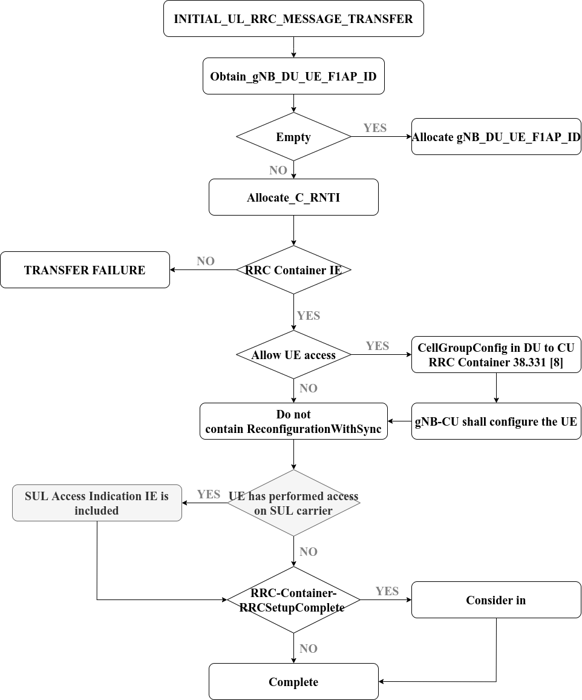

#### NR CGI

[Picture from 5G NR Cell Global Identity (NCGI) Planning and Calculations](https://www.techplayon.com/5g-nr-cell-global-identity-planning/)

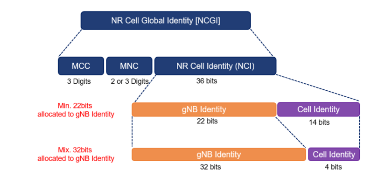

These parameters will be set in UE Configuration, which are adjustable configuration parameters. Let’s talk about PLMN first, which is composed of mobile device country code (MCC) and mobile device network code (MNC). We set it to 466 92 according to the actual mobile phone settings. , but in addition to the mobile phone instructions, we can go through this website [Mobile country code](https://en.wikipedia.org/wiki/%E7%A7%BB%E5%8A%A8%E8%AE%BE%E5%A4%87%E7%BD%91%E7%BB%9C%E4%BB%A3%E7%A0%81) 
To check the corresponding code, Chunghwa Telecom is 466 92, Far EasTone is 466 03/01.

In addition, the UE Configuration is set with bitlength gNB ID and bitlength Cell ID. Currently, it is set to 22/14. When registering the gNB, it will dynamically assign a unique identification code to the designated area, and specify the bit length format through the bitlength gNB ID and bitlength Cell ID.

## ***DL RRC MESSAGE TRANSFER***

Purpose: to forward the RRC message RRCSetup to the gNB-DU.

### General 

The purpose of the DL RRC Message Transfer procedure is to transfer an RRC message The procedure uses UE associated signalling.

### Successful operation

The purpose of the DL RRC Message Transfer procedure is to transfer an RRC message The procedure uses UE associated signalling.

If there is a logical F1 connection related to the UE, the DL RRC MESSAGE TRANSFER message shall contain the gNBDU UE F1AP ID IE, which shall be used by the gNB-DU to look up the stored UE context. If no UE-related logical F1 connection exists, a UE-related logical F1 connection shall be established upon receipt of the DL RRC MESSAGE TRANSFER message. In the system, we default to include the relevant logical F1 link.

If the RAT Index/Frequency Selection Priority IE is included in the DL RRC MESSAGE TRANSFER, the gNB-DU may use it for RRM purposes. If the Additional RRM Policy Index IE is included in the DL RRC MESSAGE TRANSFER, the gNB-DU may use it for RRM purposes. We have not implemented this part of the system, but we still leave this IE blank.

If available, the DL RRC MESSAGE TRANSFER message shall include the old gNB-DU UE F1AP ID IE so that the gNB-DU can retrieve the existing UE context during RRC connection re-establishment, as defined in TS 38.401. In fact, in the system we will use OLD to mark the old F1AP UE and save it in the CU file, however, in the Single gNB System we will write the obtained F1AP_ID (including DU and CU) into the CU and UE files, only CU There are old and new F1APs, the gNB only refreshes the gNB-DU UE F1AP ID, and the UE gets the new gNB-DU UE F1AP ID and overwrites it in the configuration. In the Multiple gNB System, because a large number of scripts exist, we The UE configuration will be refreshed through the CU configuration delivery message, but the old gNB-DU UE F1AP ID will not be retained. This is to maximize the benefits between benefits and design flexibility.

If SRB duplication is activated, the DL RRC MESSAGE TRANSFER message shall include the Execute Duplication IE so that the gNB-DU can perform CA-based duplication for the SRB. This system is currently not implemented, as we need more time to understand this piece, but we need to set up a function for future updates.

If the gNB-DU identifies the logical F1 connection associated with the UE through the gNB-DU UE F1AP ID IE and the old gNB-DU UE F1AP ID in the DL RRC MESSAGE TRANSFER message, the same goes for the above, so in this design, we use the old gNB -DU UE F1AP ID is used here, which is more obvious in Single gNB System.

Contains IE, which releases the old gNB-DU UE F1AP ID and related configuration associated with the old gNB-DU UE F1AP ID.

If the UE Context not retrievable IE set to "true" is included in the DL RRC MESSAGE TRANSFER, then the DL RRC MESSAGE TRANSFER may contain the PLMN assistance information for the network sharing IE (if available at the gNB-CU) and can be used as specified in the In TS 38.401.

If the DL RRC MESSAGE TRANSFER message contains the New gNB-CU UE F1AP ID IE, if supported, the gNB-DU shall replace the value received in the gNB-CU UE F1AP ID IE with the value of the New gNB-CU UE F1AP ID and assign it for further signaling.

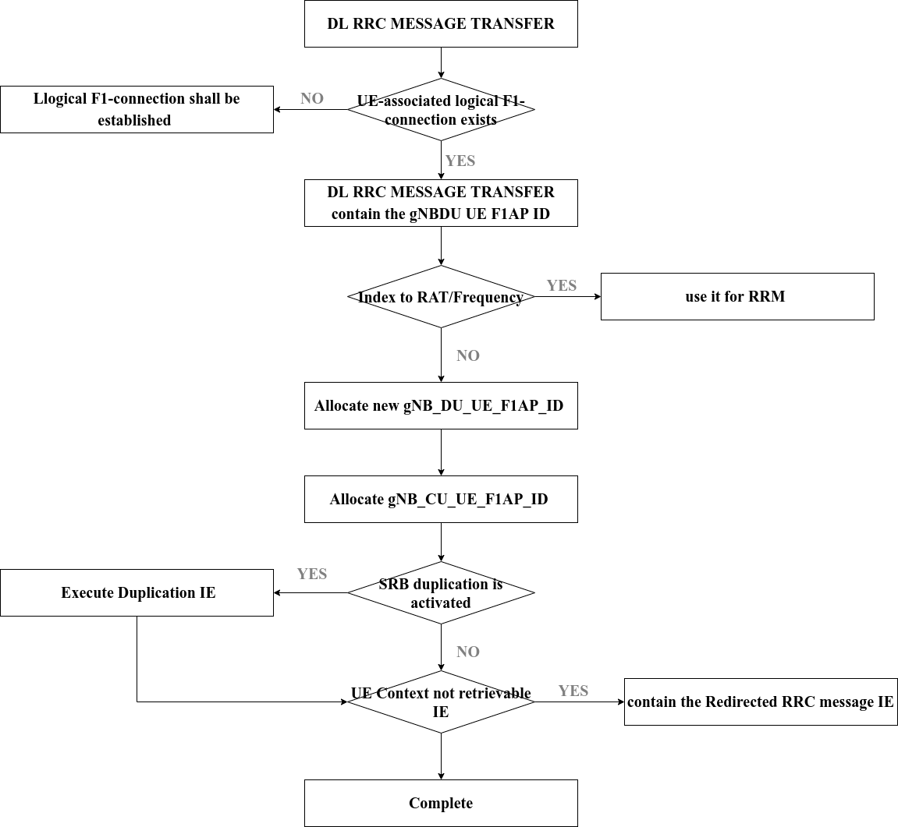

Interaction with UE context release request process
If the UE Context not retrievable IE set to "true" is included in the DL RRC MESSAGE TRANSFER, the gNB-DU may trigger the UE Context Release Request procedure as described in TS 38.401. This system is not implemented, but there are also virtual functions written for future use.

### ***Parameter***

| Name | Value | Characteristic |
| :--: | :--:  | :--: |
| gNB_DU_UE_F1AP_ID | | Allocate |
| gNB_CU_UE_F1AP_ID | | Allocate |
| SRB_ID | 1 | Static |
| RRC-Container | RRCSetup | Static |
| Execute Duplication True | Static |
| RAT-Frequency Priority Information | True | Static |
| >EN-DC | | |
| >>Subscriber Profile ID for RAT/Frequency priority  | 111111 | Static/Changeable |
| >NG-RAN  | | |
| >> Index to RAT/Frequency Selection Priority | 1010111 | Static/Changeable |
| RRC Delivery Status Request | True | Static/Changeable |

#### gNB-DU UE F1AP ID

The gNB-DU UE F1AP ID uniquely identifies the UE association over 

#### RAT-Frequency Priority Information

See Initial UL RRC Message Transfer  [9.3.1.34 ] page 184

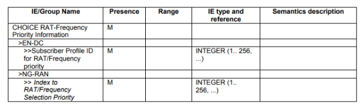

The RAT-Frequency Priority Information contains either the Subscriber Profile ID for RAT/Frequency priority IE or the Index to RAT/Frequency Selection Priority IE. These parameters are used to define local configuration for RRM strategies. 

### Abnormal Conditions 
Not applicable.

## RRCSetup

See RRCSetup  page 284
The RRCSetup message is used to establish SRB1.
Signalling radio bearer: SRB0
RLC-SAP: TM
Logical channel: CCCH
Direction: Network to UE

Return CellGroupConfiguration and radioBearerConfig

These two configurations are important configurations for establishing SRB1, but it is too complicated and presents a tree-like structure. For example, CellGroupConfiguration needs to configure at least three kinds of mac-CellGroupConfig, spCellConfig and physicalCellGroupConfig, and not including others. We will configure two Make it into a separate file, dynamically read and change the configuration we need in a small amount to optimize performance. Of course, you can also rewrite the configuration to meet your needs, but we have searched for a long time (note that the 3GPP standard will tell You, you should carry this IE here, and it will tell you what configuration to carry, but it takes a long time to find the detailed information. It is recommended to check the RLC protocol, which is less content than the RRC and F1AP protocols, but it is also more inclined to the physical level), get the details The configuration has about 300 lines and is related to each other. It is better not to change it.

## Reception of the RRCSetup by the UE 

See Reception of the RRCSetup by the UE  [5.3.3.4] page 55

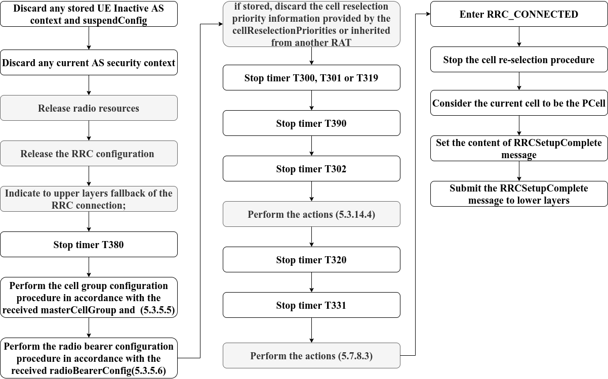

### List waited update:

1. Perform the cell group configuration procedure in accordance with the received masterCellGroup  (5.3.5.5)
2. Perform the radio bearer configuration procedure in accordance with the received radioBearerConfig(5.3.5.6)
3. Perform the actions T302, T390 expiry or stop (Barring alleviation) (5.3.14.4)
4. Perform the actions T331 expiry or stop (5.7.8.3)

### Cell Group configuration

See Cell Group configuration 5.3.5.5 Page 69

#### General 

The network configures the UE with Master Cell Group (MCG), and zero or one Secondary Cell Group (SCG). In (NG)EN-DC, the MCG is configured as specified in TS 36.331 [10], and for NE-DC, the SCG is configured as specified in TS 36.331 [10]. The network provides the configuration parameters for a cell group in the CellGroupConfig IE. 

The configuration process is shown in the figure

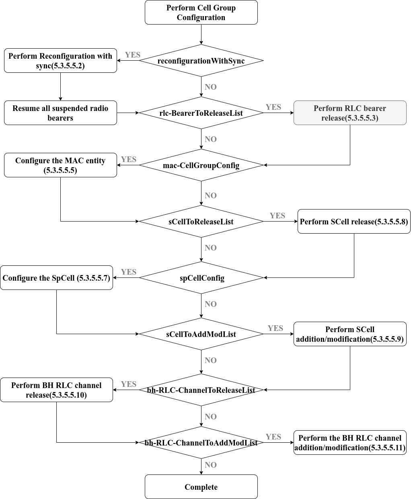

Among them, the most important thing to pay attention to is the synchronization of Reconfiguration with sync. We have done this part. Although we think there is still room for improvement, other parts are virtualized. According to Cell Group configuration 5.3.5.5.2 page 70, Make the following configuration

#### Reconfiguration with sync 

This is used as the RNTI to assign the C-RNTI to the UE.38.331(v15.1)-5.3.5.5.2 state, "Apply the value of the new UE-Identity as the C-RNTI for this cell group"

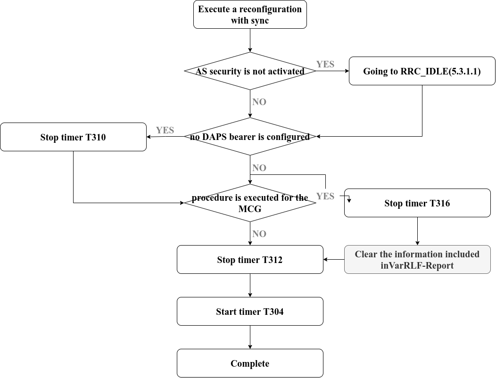

No matter which system it is in, we will synchronously update the reconfigured UE-Identity on the UE and CU side (through gNB, but will not be saved on the gNB to speed up the calculation). By the way, the Timer related configuration is in the Single gNB. In the system, the main control UE has a special way to control the running state of each timer.

#### RLC bearer release 

See Cell Group configuration 5.3.5.5.3  Page 72
The UE shall:
1> for each logicalChannelIdentity value included in the rlc-BearerToReleaseList that is part of the current UE
configuration within the same cell group (LCH release); or
1> for each logicalChannelIdentity value that is to be released as the result of an SCG release according to 5.3.5.4:
2> release the RLC entity or entities as specified in TS 38.322 [4], clause 5.1.3;
2> release the corresponding logical channel. 

This system has not been implemented, but the reason is very simple. It takes a lot of time to study the Cell Group. Unfortunately, RLC really needs time to digest, but we highly recommend to look at the RLC protocol. NFV technology needs to be defined in software, but The interface facing the shadow still needs to abide by its regulations.

## Reception of the RRCReject by the UE

See Reception of the RRCSetup by the UE  [5.3.3.5] page 55

The UE shall:
perform the actions as specified in 5.3.15;

### Initiation

The UE initiates the procedure upon the reception of RRCReject when the UE tries to establish or resume an RRC connection.

Reception of the RRCReject by the UE 

1. stop timer T300, if running;
2. stop timer T319, if running;
3. stop timer T302, if running;
4. reset MAC and release the default MAC Cell Group configuration
5. If waitTime is configured in the RRCReject:then start timer T302, with the timer value set to the waitTime;
6. if RRCReject is received in response to a request from upper layers:then inform the upper layer that access barring is applicable for all access categories 7. except categories '0' and '2';
8. If timer T331 is running, the UE continues to perform idle/inactive measurements according to (5.7.8)

The flow chart is as follows

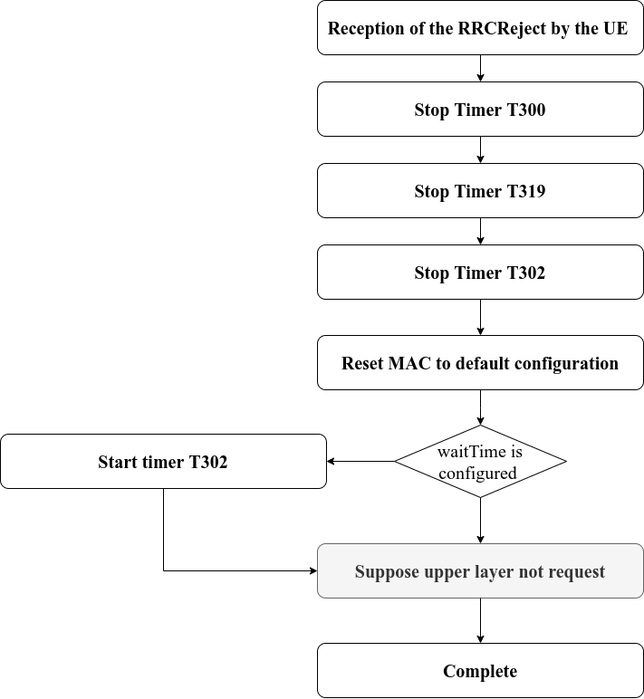