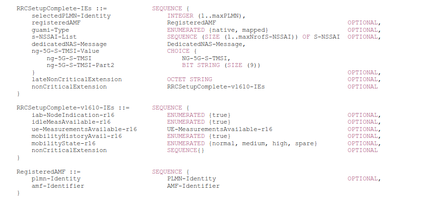

# ***Second Step:RRC_CONNECTION_SETUP_COMPLETE***

## ***RRC_CONNECTION_SETUP_COMPLETE***

See 3GPP TS 38.331 version 16.3.1 Release 16 page 285

The RRCSetupComplete message is used to confirm the successful completion of an RRC connection establishment.
Signalling radio bearer: SRB1
RLC-SAP: AM
Logical channel: DCCH
Direction: UE to Network

### RRCSetupComplete message

| Name | Value | Characteristic |
| :--: |:--: | :--: |
| selectedPLMN_Identity_Index | 0 | in Config|
| RegisteredAMF | (plmn-Identity + amf-Identifier) | in Config |
| >PLMN-Identity | 4662 | in Config |
| >AMF-Identifier |bits(24) | in Config |
| Guami_Type | mapped | Static |
| s_NSSAI_List | SEQUENCE | in Config |
| DedicatedNAS_Message | Service_Request | Static |
| ng-5G-S-TMSI-Value | | in Config |

Where NSSAI see TS 138.331 page 621, S-NSSAI (Single Network Slice Selection Assistance Information) identifies end-to-end network slices, including slice/service type and slice specifier, see TS 23.003 [21]. It is composed of 8 or 32 bits.

### UL_RRC_MESSAGE_TRANSFER