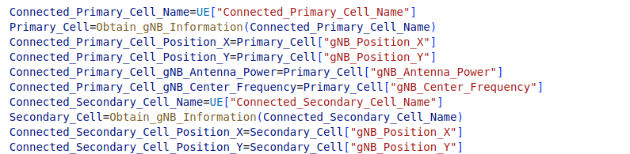

# **RSRP Detection System**

## ***Single gNB System***

These are LOS Uma Model  Flow Chart in Single gNB System and Multiple gNB System

The UE requests information from the gNB. You can think of it as in real life, the UE requests the gNB. In the system, we will obtain the gNB data and obtain the parameters used to calculate the RSRP, because in fact, the RSRP is received by the received parameters, which are fed back to the gNB by the UE

This is the flow chart of the calculation of Pathloss at the beginning. Because the Pathloss model is divided into two parts according to the distance, it is very important to calculate the breakpoint and establish a suitable model for the distance range. It should be noted that the center frequency of our parameter is set in MHz The unit needs to be multiplied by one million. At the beginning, it was stuck here for a long time, because it was divided by the speed of light (the document stated that it was 3*10 to the 8th power), but that was the interruption point. If you want to calculate Pathloss needs to be divided by one thousand and calculated in GHz.

However, calculating the interruption point all the time will slow down the efficiency. In the main UE, it is especially important to pay attention to this: the immediacy of user control, our system field setting is (-800,800) This setting can be dynamically set, but this means that Within this range, the furthest distance between two points is $\ce{1600*2sqrt{2}}$
16002, which is about 2262.74169979695, which is lower than the calculated breakpoint distance of 3038.5020760604075, so we add the Path_Loss_Permanentg parameter to indicate the permanence of the PathLoss Model, and omit the calculation of the breakpoint each time the RSRP is updated.

Each update has to be recalculated, but the calculation time is second, the focus is on the dynamic read and write actions from the configuration file, so we designed the flexibility of the program to ensure that under the safety of the configuration file, reduce Minimal movement for reading and writing.

## ***Multuiple gNB System***

Unlike the Single gNB system, which has the main control UE, the Multiple gNBs system does not have the main UE and adopts a symmetric architecture, so in our simulation, the gNB and the UE are randomly generated at the beginning, we call it For Initialization, this creates a very important problem: because of randomness, the process and algorithm must be set to elastic.

However, our gNB does not move, so the algorithmic points of the two are different. The comparison is as follows:

| | gNB | UE |
| :--: | :--: | :--: |
| Fixed information | Location,Antenna power,Center frequency | Name,IP location
| Dynamic information | Currently connected UE | Location,Currently connected PCell and SCell,RSRP |
| static variable | User Terminal High | |
| algorithm focus | Correspondence between MCG and SCG | Instant dynamic updates |

After that, we will allocate a new CellGroup setting through the RRC request, and determine the PCell and SCell of each UE here, which is an important basis for our next calculation.

## Figuratuions

### Axes Only

We use the Cartesian coordinate system to establish the field layout of the plane, and the size is set according to the parameters
| Name | Significance | Set Value | Location |
| :--: | :--: | :--: | :--: |
| X_RANGE | The field sets the visible range (positive value of the X axis) | 800 | System_Field_Configuration |
| Y_RANGE | The field sets the visible range (positive value for the Y axis) |800 | System_Field_Configuration |

### gNBs Initialization

We will put gNB (data from the initial gNB transmission) on the coordinate system, use the same color to avoid draft mix, and mark the name next to it. The parameters are as follows:

| Name | Significance | Set Value |
| :--: | :--: | :--: |
| gNB_Position_X | X coordinate of gNB | (-X_RANGE,X_RANGE) |
| gNB_Position_Y | Y coordinate of gNB | (-Y_RANGE,Y_RANGE) |
| gNB_Center_Color | The color of the center, in the Multiple gNBs System, all gNBs have the same color | #2CD8C1 |
| gNB_Range_Color |Only Single gNB System has | #2CD8C1 |

### Range setting

In the Single gNB System, the gNB_Range parameter indicates the range of alerts generated by the center coordinates of the gNB, so the calculation is very simple. However, the setting in the Multiple gNBs System is not so simple. scope.

#### Single gNB System

| Name | Significance | Set Value |
| :--: | :--: | :--: |
| gNB_Range | The warning range generated is based on the center coordinate of gNB as the range | 650 |

#### Multiple gNBs System

In the Multiple gNBs System, there is a parameter that sets the range type parameter, we are divided into the following types

1. Rectangle (square is also limited)
2. Ellipse (circle is also limited here)
3. Polygons (triangles, etc.)
4. Others (concave polygons, etc.)
5. Unusual geometry (not yet implemented)

Range_Type has corresponding parameters, in most cases, they are recorded in System_Field_Configuration, and will not be common.

##### Rectangle

| Name | Significance | Set Value |
| :--: | :--: | :--: |
| Range_Color | Parameters that all shapes have | #9C0C0C |
| Rectangle_Start_X | The X coordinate of the lower left corner | -291 |
| Rectangle_Start_Y | The Y coordinate of the lower left corner | -223 |
| Rectangle_Width | The width of Range | 591 |
| Rectangle_Length | The length of range  | 395 |

See the figure below:

The Multiple gNBs System starts from the gNB. It will send a brief gNB message first, and send it to the CU and UE to back it up, that is, the data of the gNB at the beginning. and will continue to be used in this system.

After that, we will allocate a new CellGroup setting through the RRC request, and determine the PCell and SCell of each UE here. This is an important basis for our next calculation. This setting will be updated and calculated.

After setting the gNB information, the RSRP calculation will be performed next, and the model to be applied will be determined according to the distance between the interruption point and the plane. At this stage, we will perform the calculation according to the locally saved information updated by RRCSetUp.

Two Cells can be seen above: one is primary and the other is secondary. When RSRP is calculated, three RSRPs are calculated and returned:

| Cell | Calculate |
| :--: | :--: |
| Connected_Primary_Cell | RRCSetUp assignment |
| Connected_Secondary_Cell | RRCSetUp assignment |
| Special_Cell | Except for the third special Cell set by Connected_Primary_Cell and Connected_Secondary_Cell |

But considering the actual situation, we set the distribution of gNB as a graph, and calculate the location of the third Special_Cell according to the adjacent algorithm. This is for three-phase positioning. In fact, our mobile phone will only connect to two base stations at a time. However, there is also the existence of Special Cell, but it is not used in this place. It is usually called SpCell together with PCell. For details, see the previous CellGroupConfiguration.

The process of calculating Special gNB is as follows:

1. Search for other Cells of the CellGroup of Primary_Cell
2. If there are no other Cells other than Primary_Cell or Secondary_Cell
3. Search for other Cells of the CellGroup of Secondary_Cell
4. If not, search for the next closest CellGroup
5. Search for the closest Cell to Primary_Cell in the closest CellGroup

The specific flow chart is as follows

After calculating the RSRP, the UE will feed it back to the gNB, and then the gNB will calculate the new MCG and SCG and send the new configuration back to the UE. The gNB will transmit the RSRP and UE information to the CU before the calculation. It will be faster, or this is the essence of mobile edge computing: dividing most of the operations to the CU.

The parameters transmitted by the UE to the gNB are as follows:

| Name | Content |
| :--: | :--: |
| UE_Name | UE name |
| Connected_Primary_Cell_Name | Primary connected gNB |
| Connected_Secondary_Cell_Name | |Secondary connected gNB |
| Connected_Special_Cell_Name | gNBs other than the above two |
| RSRP_Primary_Cell | RSRP backhauled by the gNB to which the primary connection is made |
| RSRP_Secondary_Cell | RSRP backhauled by the secondary connected gNB |
| RSRP_Special_Cell | RSRP returned by Special_Cell gNB |

In fact, more parameters will be used, but the less data, the faster the propagation speed. In addition, gNB already has other gNB configurations, so we only need to pass the minimum parameters, and then let gNB judge the next one by itself Accessed gNB.

The UE will make a judgment after receiving the returned data. If the parameter remains unchanged, it will not change it. This is an important part of ensuring our read and write security and acceleration, because in terms of probability, we can determine , the probability of not changing hands is smaller than the probability of changing hands, and making judgments can reduce our expectation of wasting time.

The CU will perform operations according to the data received by the order. It will first calculate the corresponding distance from each gNB to the UE, and then generate a circle equation. We first judge Primary_Cell and Secondary_Cell, and then judge by Secondary_Cell and Special_Cell.

At this time, three situations will occur:

1. intersect
2. separated
3. Cut-off point

Mathematically, that's true, but, in reality, we're locating a point, so we're going to get rid of the dissociation, because that can't happen from our situation, there's only intersection and tangent left. The situation, however, is only one possibility and two possibilities for us.

The code reference [Python代碼求解兩圓交點坐標](https://blog.csdn.net/qq_30336905/article/details/102972915), he calculates according to the auxiliary line, as shown below:

This article has brought us a lot of help, because geometric drawing requires a lot of calculations to be digitized. In short, three circles are used for three positioning, but the result still has a decimal point error, because the output The value of is a floating point number, but we set it to only move in integers, though, that doesn't really matter.

After obtaining the point, we will first draw the position of the point on the canvas. No operation is performed on this matter, because this is a very time-consuming operation method. We will perform the operation on other programs. In fact, the canvas and the operation are two programs that interact with each other through configuration files.

Then use a solid line to draw the connection between PCell and UE. This is a very important part. You can see the simplified version of the handover here. To be honest, it should not be used in the official handover calculation. method, but the interaction between the UE and these gNBs can be seen over time.

Finally, draw the SCell with a dotted line. In fact, this step can be omitted, because the dotted line becomes a little invisible, but for some reasons, we still decide to go up, but the flexible design makes it very convenient for us to cancel.

Of course, we will also mark the color and name of the UE in the lower right corner.

We try to avoid using a lot of read and write operations and operations in GUI programs, because Mataplotlib itself is a program that consumes a lot of computing resources, so we will add the OUT_OF_RANGE parameter to the configuration file. For this, we will mark it in the operation part Whether it is out of range is determined by specifying the range with the RANGE_Type parameter.

The determination of geometric shapes is similar, so we take the rectangular behavior as an example:
At this point we already know the approximate coordinates of the UE, so we will use this coordinate to determine whether it is within or outside the range we specified.

If you copy out the range, it will indicate that it has left the range, the program will alert the GUI, and the font will turn red, in fact, if this will be applied elsewhere, you can write a different alert here: LineBot is a good Methods.

Alert Status:

In short, the results watch the video.