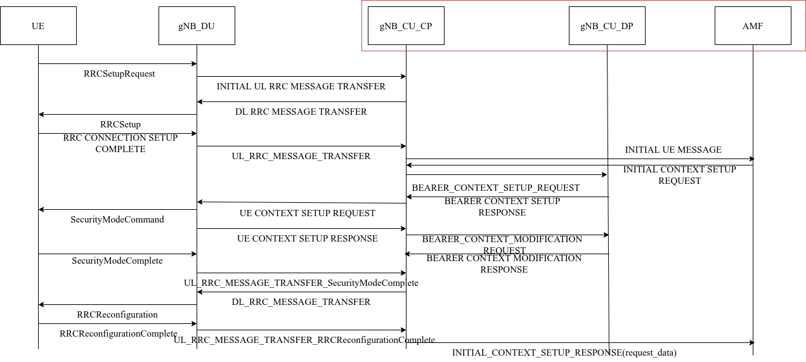

# **TO DO LIST**

## Wait for fixed

- [ ] Fix JSONDecoderError for System_Field_Configuration.py(CU):Obtain_CU_gNB_UEs_Configuration
- [ ] Fix JSONDecoderError for UEs_Uma_Simlation_Script.py(UE):Obtain_System_Field_Configuration
- [ ] Fix RRCSetUp Actions
- [ ] Add RRC Cell Group Configuration

## Progress this week

- [x] 22 steps to complete UE access to core network
- [x] Complete the graphical interface and script of the Single_LOS_Uma model
- [x] Complete the Multiple_LOS_Uma model (under revision)
- [x] Strength the RRC and F1AP Protocal

## progress next week

- [ ] Complete the changeover mechanism
- [ ] Irregular Graph Algorithm
- [ ] MCG and SCG RRC protocol level access
- [ ] Perform Cell Configuration

## 6/2/2022 Diary

- [x] Document First draft First Statement:Background
- [ ] Multiprogress Distributed MCG and SCG in RRC:RRC Set UP for Multiple gNB System
- [ ] Collation Single_LOS_Uma System:UE_Program
- [ ] Draw NIU MAP:With Line

## Information

- [ ] SRB
- [ ] RRC
- [ ] MAC Cell Group configuration
- [ ] RAT-Frequency Priority 