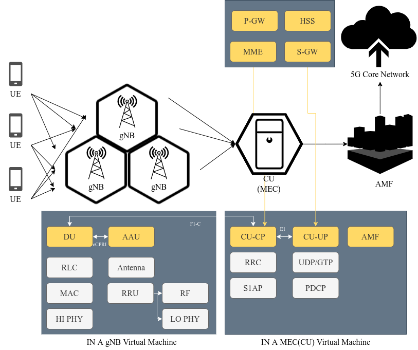
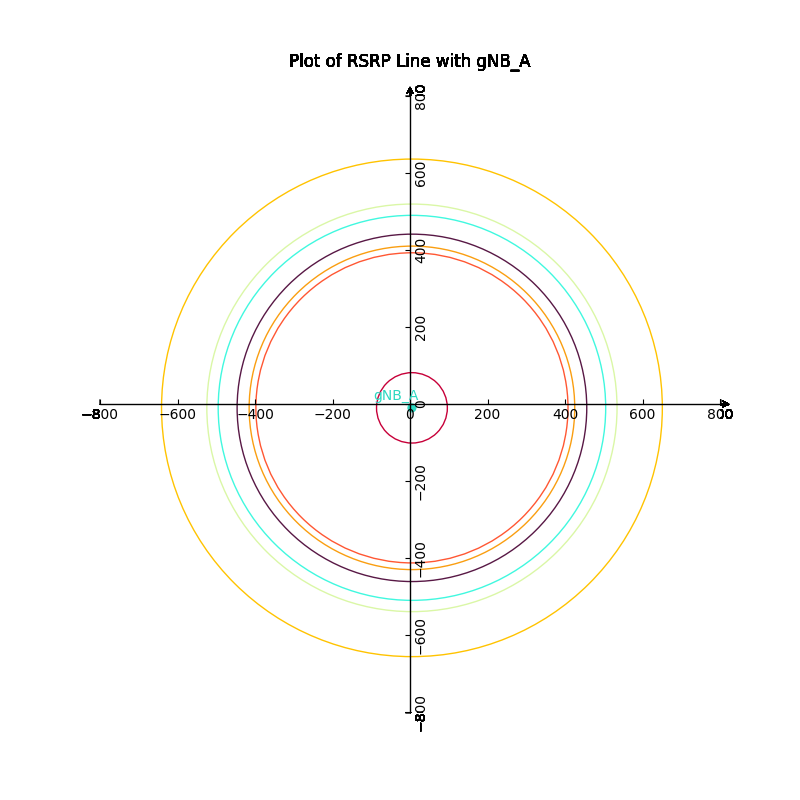
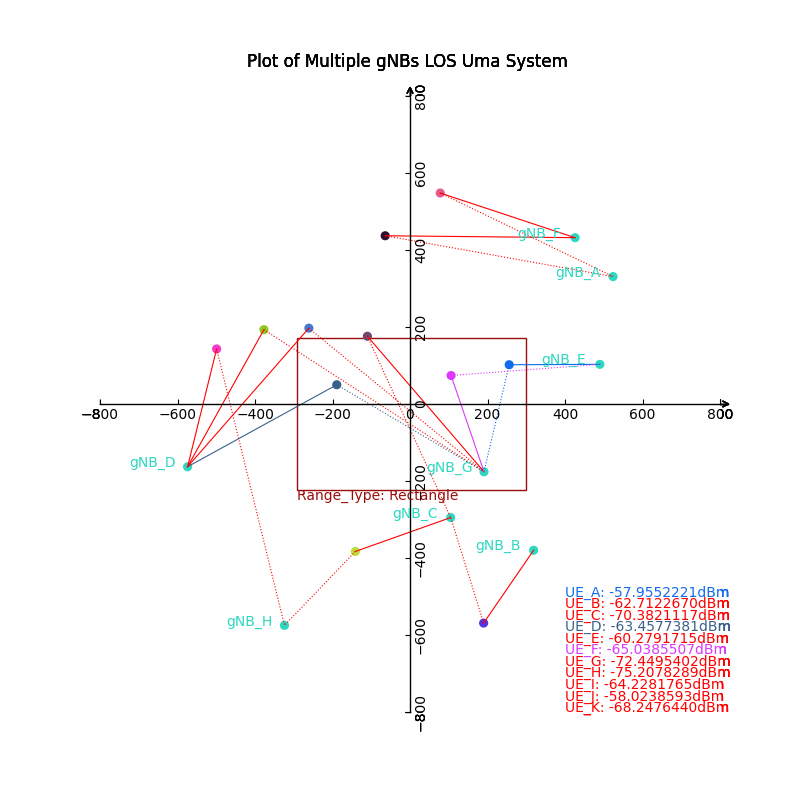
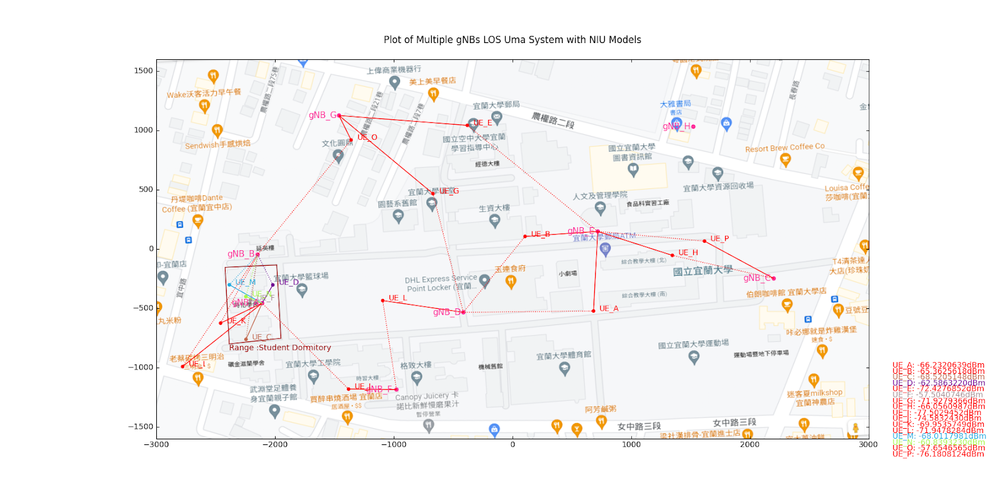

# Cloud-RAN-Simulation-Electronic-Fence-Based-on-NFV

## Architecure

This is an NFV-based electronic fence simulation system. This project is still under development, and KVM will be used for further development in the future.

For details, see the video and plan:
[Introduction Video](https://www.youtube.com/watch?v=JeUSECjrwqY&ab_channel=YuWen)
2022 Program Competition Special Project Proposal - Smart Electronic Fence System Based on NFV Virtual Cloud Computing.pdf

## This project is formulated with reference to the 3GPP agreement

|Protocal|Version|
| :--: |:--:|
| RRC|ETSI TS 138 331 V15.15.0 (2021-10)|
| F1AP|ETSI TS 138 473 V16.5.0 (2021-04)|
| E1AP|ETSI TS 138 463 V16.4.0 (2021-01)|
| S1AP|ETSI TS 136 413 V16.5.0 (2021-04)|
| NAS|ETSI TS 124 501 V16.10.0 (2021-09)|
| NGAP|ETSI TS 138 413 V16.7.0 (2021-10)|

## Now completed:

Uma Los model of

### Sinlge gNB system

### Multiple gNBs System

### NIU Model

